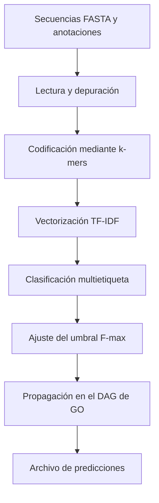

# CAFA 6: Protein Function Prediction

Baseline de bioinformática y aprendizaje automático para predecir términos de Gene Ontology (GO) a partir de secuencias de aminoácidos.

## Objetivo

Construir un modelo base multietiqueta que estime términos GO de:

- Molecular Function (MF)
- Biological Process (BP)
- Cellular Component (CC)

El proyecto utiliza únicamente la secuencia proteica como entrada y sirve como punto de partida reproducible para evaluar representaciones y modelos más avanzados.

## Flujo de trabajo

## Implementación

El baseline combina:

- k-mers para representar las secuencias;
- TF-IDF para ponderar los fragmentos;
- regresión logística One-vs-Rest por subontología;
- optimización del umbral mediante F-max;
- propagación jerárquica de términos en el grafo de Gene Ontology.

## Notebook

[Abrir el análisis completo](notebooks/cafa6_baseline_protein_function_prediction.ipynb)

## Datos

Los datos proceden de la competición [CAFA 6 Protein Function Prediction](https://www.kaggle.com/competitions/cafa-6-protein-function-prediction). No se incluyen en el repositorio; deben descargarse desde Kaggle aceptando sus condiciones de uso.

## Limitaciones

- Es un baseline, no un modelo de estado del arte.
- La representación bag-of-k-mers pierde parte del contexto estructural de la secuencia.
- El coste computacional aumenta con el vocabulario y el número de etiquetas.
- Los resultados dependen de la partición de validación y de la propagación jerárquica empleada.

## Autor

Francisco José de la Corte López · [GitHub](https://github.com/francorte) · [Kaggle](https://www.kaggle.com/francorte)

## Licencia

MIT. Consulta [LICENSE](LICENSE).
